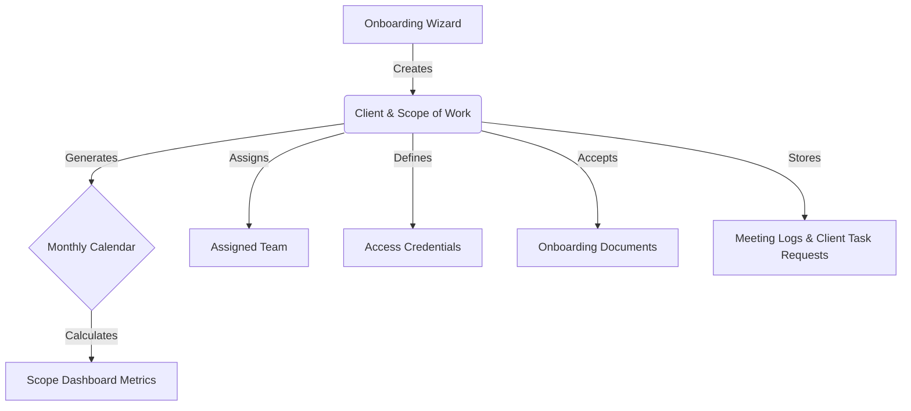
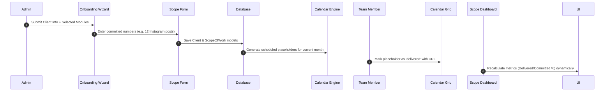

# Implementation Plan — Client Onboarding & Scope Dashboard

This plan outlines the architecture, database models, page routing, and working flow for the **Client Onboarding** and **Client Management Dashboard** features.

---

## What We Understood (Product Requirements)

We need to build an end-to-end client onboarding wizard and client detail dashboard containing the following key components:



### 1. Client Onboarding Wizard
A 5-step form to onboard new clients:
- **Step 1: Client Info**: Name, brand name, industry, website, primary contact details, competitor list (name, links), and social media handles.
- **Step 2: Modules Selection**: Select active services (Social Media, Paid Media, Email/WhatsApp, SEO, Influencer Marketing).
- **Step 3: Scope Definition**: Quantities and details of committed deliverables.
- **Step 4: Team Assignment**: Assign internal team members to this client's profile.
- **Step 5: Review & Confirm**: Final summary review before saving.

### 2. Client Profile & Detail Dashboard
An 8-tab management hub for each onboarded client:
- **Overview**: Brand metadata, contact details, competitors, social links, and progress cards for the *current calendar month's* scope deliverables (Committed, Delivered, Pending, and Delivery %).
- **Scope Dashboard / Calendar**: A grid-based Monthly Calendar view showing deliverables scheduled with start/end times. Allows marking items as `delivered` (by attaching a link/published URL) and computes completion percentages.
- **Scope of Work**: Interface to review or edit the baseline deliverables contract (Social Media counts, Paid Ad budgets, SEO keywords and integrations, Influencer limits).
- **Access Control**: A secure credential vault categorized by service (Social, Ads, Analytics, Custom) with copy-to-clipboard functionality.
- **Team**: List of team members assigned to handle this client.
- **Documents**: Repository for contract attachments, guidelines, and assets.
- **Meeting Logs**: Chronological timeline of meeting summaries and notes.
- **Request Tasks**: Inbox of client-submitted task requests that admins can approve, schedule, or reject.

---

## Proposed Database Structure

We will introduce four new Mongoose models in `lib/models/`:

### 1. `Client` Model (`client.model.ts`)
Stores basic company details, credentials vault, meeting history, documents, and references.
```typescript
interface ICompetitor {
  name: string;
  websiteLink: string;
  socialMediaLink?: string;
}

interface ISocialPresence {
  platform: string; // e.g. "instagram", "facebook", "youtube", "linkedin", "x", "custom"
  link: string;
}

interface ICredential {
  id: string;
  category: "social" | "paid-ads" | "analytics" | "custom";
  label: string;
  values: Record<string, string>; // e.g. { username: "abc", password: "123" }
}

interface IDocument {
  name: string;
  fileUrl: string;
  uploadedAt: Date;
}

interface IMeetingLog {
  title: string;
  notes: string;
  date: Date;
  loggedBy: string; // User Name
}

interface IClient extends Document {
  name: string;
  brandName: string;
  industry: string;
  website: string;
  status: "active" | "inactive";
  contractStart: Date;
  contractEnd: Date;
  primaryContact: {
    name: string;
    email: string;
    phone: string;
  };
  aboutBrand?: string;
  requirementNotes?: string;
  competitors: ICompetitor[];
  socialMediaPresence: ISocialPresence[];
  assignedTeam: mongoose.Types.ObjectId[]; // Ref User
  credentials: ICredential[];
  documents: IDocument[];
  meetingLogs: IMeetingLog[];
}
```

### 2. `ScopeOfWork` Model (`scope-of-work.model.ts`)
Stores the committed contract quantities for each service type:
```typescript
interface ISocialMediaScope {
  instagram: { reels: number; posts: number; stories: number };
  facebook: { statics: number; reels: number; posts: number; stories: number };
  youtube: { statics: number; reels: number; posts: number; stories: number };
  linkedin: { posts: number };
  x: { posts: number };
}

interface IPaidMediaScope {
  metaAds: { adSpend: number; creatives: number; commission?: number };
  googleAds: { adSpend: number; creatives: number; commission?: number };
  linkedinAds: { adSpend: number; creatives: number; commission?: number };
}

interface IScopeOfWork extends Document {
  clientId: mongoose.Types.ObjectId; // Ref Client (Unique)
  socialMedia: ISocialMediaScope;
  paidMedia: IPaidMediaScope;
  emailWhatsapp: {
    transactional: { enabled: boolean; triggers: number };
    promotional: { enabled: boolean; emails: number };
  };
  seo: {
    keywords: string[];
    gaAccess: { type: "login" | "email" | "none"; details?: string };
    gtmAccess: { type: "login" | "email" | "none"; details?: string };
    gscAccess: { type: "login" | "email" | "none"; details?: string };
    auditSheetLink?: string;
    docLink?: string;
  };
  influencer: {
    influencersCount: number;
    commission: number;
    budget: number;
  };
}
```

### 3. `CalendarDeliverable` Model (`calendar-deliverable.model.ts`)
Represents an individual scheduled deliverable (e.g. an Instagram Post or Meta Ad) scheduled for a specific date/time.
```typescript
interface ICalendarDeliverable extends Document {
  clientId: mongoose.Types.ObjectId; // Ref Client
  title: string;
  platform: "instagram" | "facebook" | "youtube" | "linkedin" | "x" | "meta-ads" | "google-ads" | "linkedin-ads" | "seo" | "email-whatsapp" | "influencer" | "custom";
  type: "reel" | "post" | "story" | "static" | "ad" | "seo-task" | "email-blast" | "influencer-campaign" | "custom";
  status: "pending" | "delivered";
  scheduledDate: Date;
  completedDate?: Date;
  publishedUrl?: string;
  notes?: string;
}
```

### 4. `ClientTaskRequest` Model (`client-task-request.model.ts`)
Represents custom tasks requested directly by the client:
```typescript
interface IClientTaskRequest extends Document {
  clientId: mongoose.Types.ObjectId; // Ref Client
  requestedBy: mongoose.Types.ObjectId; // Ref User
  title: string;
  description: string;
  status: "pending" | "approved" | "rejected" | "in-progress" | "completed";
  dueDate?: Date;
}
```

---

## Working Flow



1. **Setup & Seed**:
   Upon completing onboarding, the system automatically creates the `Client` and `ScopeOfWork` documents. It then spawns the correct number of `CalendarDeliverable` placeholders for the current month (e.g., if Instagram Reels = 4, it creates 4 unscheduled Instagram Reel placeholder items in the database).
2. **Scheduling**:
   On the **Scope Dashboard Calendar**, team members drag/assign dates and times to these deliverables, converting placeholders into scheduled tasks.
3. **Delivery Tracking**:
   Team members mark a calendar deliverable as `delivered` by attaching the publication URL. The system automatically recalculates total delivery metrics shown in the **Overview** page on-the-fly.

---

## User Review Required

> [!IMPORTANT]
> - Next.js App Router adaptations: The reference code relies on client-side routing (`react-router-dom`). We will adapt all pages to Next.js App Router architecture (`app/dashboard/clients/...` and `app/dashboard/onboarding`).
> - Deliverable Generation: On onboarding completion, we propose automatically generating the current month's skeletal deliverables in the database to jumpstart calendar scheduling.

> [!WARNING]
> - Credentials Security: For simplicity in development, credential inputs will be saved as plain text fields in MongoDB. For production deployment, they should be encrypted at rest using an encryption helper.

---

## Open Questions

> [!IMPORTANT]
> 1. Do you have a design system or component library preference (such as Radix UI, Tailwind colors, or custom UI styles) for the Calendar grid, or should we use standard CSS Grid to build a premium, custom green-accent calendar component?
> 2. Should clients have their own login access to view their dashboard directly? If so, we can let the admin toggle access and create a user account for the client.
